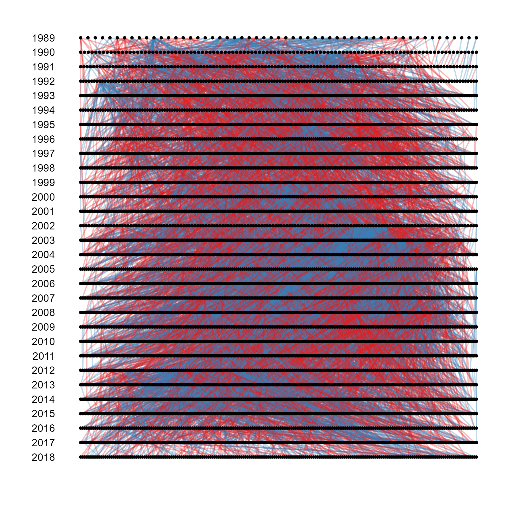

[](https://github.com/susjoh/genedroppeR/actions?query=workflow%3Apkgcheck)
[](https://github.com/susjoh/genedroppeR/actions?query=workflow%3AR-CMD-check)
## `genedroppeR`: An R package to conduct single-locus genedrop analyses through pedigrees.

This package conducts "genedrop" simulations at individual loci through complex pedigree structures to determine if changes in allele frequency are consistent with e.g. drift, directional selection, or balancing selection.

### Quick-Start Guide

To install directly from GitHub:

```         
library(devtools)
install_github("susjoh/genedroppeR")
library(genedroppeR)
```

The library comes with the `unicorn` dataset from a long-term study on the island of Áiteigin in Scotland (Figure 1). They have been genotyped for four loci:

1. Horns, a biallelic locus for horn length;
2. MHC, which characterises multi-allelic variation at the Magic Histocompatibility Locus;
-   Glitter, a biallelic locus responsible for a rare glitter coat polymorphism;
-   Xlinked, a generic X-linked SNP.

{width="200"}

Unicorns have a polygamous mating system, in common with other magical beasts. We can see an example of the pedigree below. The numbers at the side indicate the cohorts of when each unicorn was born:



#### Example 1: The Horns locus

The 
